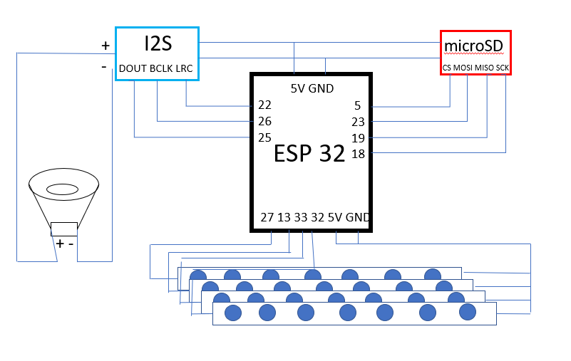

# Proyecto Reloj Despertador 

**Presentación**
En el proyecto crearemos un Reloj despertador wifi, que nos permitira modificar la alarma y los colores de la hora a  traves de un servidor Web.

Con este trabajo ampliaremos conocimientos sobre diferentes librerias y la utilización de varios modulos con diferentes protcolos de comunicación.

**Materiales**

Para el montaje del Reloj necesitaremos los siguientes  materiales:

4x Tiras LED de 7 pixels(Compatibles con la libreia NEOPIXEL de Adafruit)
1x Lector SD
1x SD o Micro SD
1x DAC Amplificador I2s 
1x Botón
1x ESP32
Cables de conexion

**CODIGO**

Codigo completo escrito en lenguaje arduino a traves del IDE Platformio

**Explicacion Codigo**

**Librerias**
```cpp
#include <Arduino.h> 
#include <WebServer.h>
#include <WiFi.h>
#include<Adafruit_NeoPixel.h>
#include <NTPClient.h>
#include <WiFiUdp.h>
#include "Audio.h"
#include "SD.h"
#include "FS.h"
```
En el proyecto hemos utilizado diversas libreiras:

Arduino.h : Para el correcto funcionamiento de las operaciones basicas en lenguaje Arduino.

WebServer.h, Wifi.h, WifiUpd.h: Se encargan de hacer funcionar el servidor web utilizando el modulo incorporado de la placa ESP32 

Adafruit_NeoPixel.h: Se encarga de las Tiras Led nos permitira conectar diversos Leds controlados a travesd e un solo pin GPIO.

NTPClient.h: Se encarga de obtener la hora en tiempo real a traves de un servidor utilizando la conexion WIFI a internet.

Audio.h: Se encaraga de la utilización del DAC a traves del protocolo de comunicación I2s

SD.h,FS.h : Son las encargadas de gestionar archivos a traves de la tarjeta sd que contendra los archivos .mp3 para poder reproducirlos.


**Declaraciones**
```cpp
//Variables programa
int udantic1=10;   //Variables utilizadas para el cambio de numeros en las tiras LED
int udantic2=10;
int hantic1=10;
int hantic2=10;

int posValue1; //Variables utilizadas para la obtencion  de valores a traves del servidor Web
  int posValue2;
  int endValue1;
  int endValue2;

  int value1=25;// Valores de accionamiento de la alarma(Establecidos en una hora irreal para que nunca suene ya que si los dejamos en 0 sonaria a las 00)
  int value2=61;


int R=0;  //Variables  Para cambiar los colores de la hora
int G=0;
int B=100;
int oR=0;
int oG=0;
int oB=100;

```

Las siguientes variables son para poder crear el Webserver con la conexion WIFi 

```cpp
//Variables server
unsigned long currentTime = millis();
// Previous time
unsigned long previousTime = 0; 
// Define timeout time in milliseconds (example: 2000ms = 2s)
const long timeoutTime = 2000;

//const char *ssid     = "Redmi Note 8 Pro";
//const char *password = "bhvgdgrxsfrh583";
const char *ssid     = "LAPTOP-7DU9NPMG 3407";
const char *password = "79437!dA";
// Define NTP Client to get time
WiFiUDP ntpUDP;
NTPClient timeClient(ntpUDP, "pool.ntp.org");

WebServer server(80);
```
Tenemos la SSID y la PSWRD del router al que nos vamos a conectar, variables millis para no utilizar delays y declaracion de objetos como el WEBSERVER y NTPClient que nos permitira obtener la hora a traves del servidor "pool.ntp.org"


**Utilidades**
```cpp
/// Utilitats

int de(int n){
int b,c;
b=n/10;
c=b%10;
return c;}

int ud(int n){
int b;
b=n%10;
return b;}
```
Como la hora la obtenemos en valores enteros de dos cifras necesitamos separar cada valor en una cifra para poderlo representar en cada tira un numero, por eso declaramos estas pequeñas funciones.

**Delaracion de Perifericos**

```cpp 
// microSD
#define SD_CS          5
#define SPI_MOSI      23 
#define SPI_MISO      19
#define SPI_SCK       18
 
// I2S Connections

#define I2S_DOUT      22
#define I2S_BCLK      26
#define I2S_LRC       25
//ledpins
#define PIN_1       27//ud ho
#define PIN_2        13//dec ho
#define PIN_3       33 //ud min
#define PIN_4       32//dec min
#define NUMPIXELS 7
Adafruit_NeoPixel h1(NUMPIXELS, PIN_1, NEO_GRB + NEO_KHZ400); 
Adafruit_NeoPixel h2(NUMPIXELS, PIN_2, NEO_GRB + NEO_KHZ400);
Adafruit_NeoPixel m1(NUMPIXELS, PIN_3, NEO_GRB + NEO_KHZ400);
Adafruit_NeoPixel m2(NUMPIXELS, PIN_4, NEO_GRB + NEO_KHZ400);
//altavoz
Audio audio;


//boton  

struct Button {
  const uint8_t PIN;
  bool pressed;

};
Button boton = {14,false};
```
En esta parte del programa dediniremos todos los perifericos utilizados donde los configuramos con sus correspondientes pines.
Tenemos un Lector SD, un DAC, las 4 tiras led, un struct para el boton.

**Funciones HTML**
```cpp
//WEBSERVER UTILITIES
void handleRoot() {
  String html = "<html><body>";
  html += "<h1>Control de variables</h1>";
  html += "<form action='/color' method='POST'>";
  html += "Color: <input type='color' name='color' value='#" + String(R, HEX) + String(G, HEX) + String(B, HEX) + "'><br>";
  html += "<input type='submit' value='Cambiar color'>";
  html += "</form>";
  html += "<br>";
  html += "<form action='/values' method='POST'>";
  html += "Hora: <input type='number' name='value1' value='" + String(value1) + "'><br>";
  html += "Minuto: <input type='number' name='value2' value='" + String(value2) + "'><br>";
  html += "<input type='submit' value='Establecer Alarma'>";
  html += "<input type='button' value='Borrar Alarma' onclick='establecerValores()' onclick='actualizarFrase()'>";
  html += "</form>";
  html += "<br>";
  html += "<br>";
  html += "<p id='mensaje' style='display:";
  html += (value1 >= 24 || value2 >= 60) ? "none" : "block"; // Oculta la frase si se cumplen las condiciones
  html += "'>La alarma esta establecida a las " + String(value1) + ":" + String(value2) + "</p>";
  html += "<script>";
  html += "function establecerValores() {";
  html += "document.getElementsByName('value1')[0].value = 25;";
  html += "document.getElementsByName('value2')[0].value = 61;";
  html += "actualizarFrase();";
  html += "}";
  html += "function actualizarFrase() {";
  html += "var mensaje = document.getElementById('mensaje');";
  html += "mensaje.style.display = (document.getElementsByName('value1')[0].value >= 24 || document.getElementsByName('value2')[0].value >= 60) ? 'none' : 'block';";
  html += "}";
  html += "</script>";
  html += "</body></html>";
  server.send(200, "text/html", html);
}
```
En la funcion handle root definimos todo lo que sera mostrado en la pagina web en nuetro caso nos mostrara un titulo despues un selector de colores y dos casillas de seleccion de numeros para introducir los valores de la alarma cuando esta de establezca aparecera una frase diciendo a que hora se ha establecido.

```cpp
void handleColor() {
  if (server.hasArg("color")) {
    String colorValue = server.arg("color");
    colorValue.replace("#", "");

    if (colorValue.length() == 6) {
      R = strtol(colorValue.substring(0, 2).c_str(), NULL, 16);
      G = strtol(colorValue.substring(2, 4).c_str(), NULL, 16);
      B = strtol(colorValue.substring(4, 6).c_str(), NULL, 16);
    }
  }
  server.sendHeader("Location", "/");
  server.send(302);
}
```

En esta función tenemos el serlector de colores RGB que nos permitiran cambiar el color de las tiras RGB.

```cpp
void handleValues() {
  if (server.hasArg("value1") && server.hasArg("value2")) {
    value1 = server.arg("value1").toInt();
    value2 = server.arg("value2").toInt();
  }
  server.sendHeader("Location", "/");
  server.send(302);
}
```
Con esta funcion obtenemos la variables que nos permetiran hacer sonar la alarma.

**SETUP**`

```cpp
void setup() {
  Serial.begin(115200); //INICIAR SERIAL

  // Set microSD Card CS as OUTPUT and set HIGH
    pinMode(SD_CS, OUTPUT);      
    digitalWrite(SD_CS, HIGH); 
    
 // Initialize SPI bus for microSD Card
    SPI.begin(SPI_SCK, SPI_MISO, SPI_MOSI);

// INICIAR TIRAS
  h1.begin();
  m1.begin();
  h2.begin();
  m2.begin();

  
  // Start microSD Card
    if(!SD.begin(SD_CS))
    {
      Serial.println("Error accessing microSD card!");
      while(true); 
    }

  
  
  // Connect to Wi-Fi
  Serial.println("");
  Serial.println("");
  Serial.println("");
  Serial.print("Connecting to ");
  Serial.println(ssid);
  WiFi.begin(ssid, password);
  while (WiFi.status() != WL_CONNECTED) {
    delay(500);
    Serial.print(".");
  }
  Serial.println(WiFi.localIP());

//audio
 audio.setPinout(I2S_BCLK, I2S_LRC, I2S_DOUT);// pins Audio
  audio.setVolume(21);//volumen
   

//boton 
pinMode(boton.PIN, INPUT_PULLUP);
  // attachInterrupt(boton.PIN, isr, FALLING);

// Initialize a NTPClient to get time
  timeClient.begin();
  timeClient.setTimeOffset(7200);//ZONA HORARIA EN SEG
  timeClient.update();//OBTENCION HORA
  //server
 server.on("/", handleRoot);//ENCENDER SERVER
  server.on("/color", handleColor);//ENCENDER SERVER
  server.on("/values", handleValues);//ENCENDER SERVER

   
   server.begin();

 
 
 
}
```
En el SETUP tendremos que inicializar todos objetos y protocolos utilizados
Primero de todo iniciamos el Serial para poder obtener la Ip en la cual estra alojada la pagina WEB

Despues configuramos los pins de la SD para que podamos acceder a ella mas tarde tenemos un if con una linea de texto en modo de control de error, en caso de que el programa no se pueda conectar nos saldra un error.

Despues inicializamos el bus SPI para la tarjeta SD

Tambien Iniciamos las 4 tiras led cada una de ellas correspondera con un numero de la hora 


Configuraremos el Wifi y lo conectaremos si este no conecta igual que con la tarjeta SD nos enviara un mensaje de error por el serial, una vez se conecte correctamente nos mostrara la IP por el serial.

Configuramos los pines del audio y el volumen

Configuramos el Pin en el cual va conectado el boton en modo input_pullup para detecatar el cambio de estado.

Y finalmente ejecutamos las funciones con codigo html y inicamos el servidor.


**LOOP**
```cpp
void loop() {
 //server 
server.handleClient();
audio.loop();
//obtencion de horas
  timeClient.update();
int currentHour = timeClient.getHours();
int currentMinute = timeClient.getMinutes();
int decmin=de(currentMinute);
    int udmin=ud(currentMinute);
    int decho=de(currentHour);
    int udho=ud(currentHour);
```

En esta parte del loop conseguimos la hora real y separamos en cifras los minutos y las horas 
ademas esperamos la respuesta del servidor y iniciamos el loop de audio pero sin ningun archivo seleccionado.


**LOOP CIFRAS**
```cpp
//led unitat MIN
int min1;                   
if(udantic1 != udmin or oR != R or oG != G or oB != B){ 
  
  
  min1=udmin;
  if(min1==0){
  m1.clear();
  m1.setPixelColor(0, m1.Color(R,G,B));
  m1.setPixelColor(1, m1.Color(R,G,B));
  m1.setPixelColor(2, m1.Color(R,G,B));
  m1.setPixelColor(3, m1.Color(R,G,B));
  m1.setPixelColor(4, m1.Color(R,G,B));
  m1.setPixelColor(5, m1.Color(R,G,B));
  m1.show();}
  else if (min1==1){
    m1.clear();
  m1.setPixelColor(0, m1.Color(R,G,B));
  m1.setPixelColor(5, m1.Color(R,G,B));  
  m1.show();
  }
   else if (min1==2){
    m1.clear();
  m1.setPixelColor(0, m1.Color(R,G,B));
  m1.setPixelColor(1, m1.Color(R,G,B));
  m1.setPixelColor(6, m1.Color(R,G,B));
  m1.setPixelColor(3, m1.Color(R,G,B)); 
  m1.setPixelColor(4, m1.Color(R,G,B));
  m1.show();
  }
   else if (min1==3){
    m1.clear();
  m1.setPixelColor(0, m1.Color(R,G,B));
  m1.setPixelColor(1, m1.Color(R,G,B)); 
  m1.setPixelColor(6, m1.Color(R,G,B));
  m1.setPixelColor(5, m1.Color(R,G,B)); 
  m1.setPixelColor(4, m1.Color(R,G,B));
  m1.show();
  }
   else if (min1==4){
  m1.clear();
  m1.setPixelColor(0, m1.Color(R,G,B));
  m1.setPixelColor(2, m1.Color(R,G,B));  
  m1.setPixelColor(6, m1.Color(R,G,B));
  m1.setPixelColor(5, m1.Color(R,G,B)); 
  m1.show();
  }
  else if (min1==5){
    m1.clear();
  m1.setPixelColor(1, m1.Color(R,G,B));
  m1.setPixelColor(2, m1.Color(R,G,B));  
  m1.setPixelColor(6, m1.Color(R,G,B));
  m1.setPixelColor(5, m1.Color(R,G,B)); 
  m1.setPixelColor(4, m1.Color(R,G,B));
  m1.show();
  }
  else if (min1==6){
    m1.clear();
  m1.setPixelColor(1, m1.Color(R,G,B));
  m1.setPixelColor(2, m1.Color(R,G,B));  
  m1.setPixelColor(6, m1.Color(R,G,B));
  m1.setPixelColor(3, m1.Color(R,G,B)); 
  m1.setPixelColor(4, m1.Color(R,G,B));
  m1.setPixelColor(5, m1.Color(R,G,B));
  m1.show();
  }
   else if (min1==7){
    m1.clear();
  m1.setPixelColor(0, m1.Color(R,G,B));
  m1.setPixelColor(1, m1.Color(R,G,B)); 
  m1.setPixelColor(5, m1.Color(R,G,B));
  m1.show();
  }
   else if (min1==8){
    m1.clear();
  m1.setPixelColor(0, m1.Color(R,G,B));
  m1.setPixelColor(1, m1.Color(R,G,B));
  m1.setPixelColor(2, m1.Color(R,G,B));
  m1.setPixelColor(3, m1.Color(R,G,B)); 
  m1.setPixelColor(4, m1.Color(R,G,B));
  m1.setPixelColor(5, m1.Color(R,G,B));
  m1.setPixelColor(6, m1.Color(R,G,B));
  m1.show();
  }
    else if (min1==9){
    m1.clear();
  m1.setPixelColor(0, m1.Color(R,G,B));  
  m1.setPixelColor(1, m1.Color(R,G,B));
  m1.setPixelColor(2, m1.Color(R,G,B));
  m1.setPixelColor(6, m1.Color(R,G,B));  
  m1.setPixelColor(5, m1.Color(R,G,B));  
  m1.setPixelColor(4, m1.Color(R,G,B)); 
  m1.show();
    }
    else{m1.clear();}
 
 udantic1=min1;
 }

//led Decenes MIN
int min2;
if(udantic2 != decmin or oR != R or oG != G or oB != B){ 
  min2=decmin;
  if(min2==0){
  m2.clear();
  m2.setPixelColor(0, m2.Color(R,G,B));
  m2.setPixelColor(1, m2.Color(R,G,B));
  m2.setPixelColor(2, m2.Color(R,G,B));
  m2.setPixelColor(3, m2.Color(R,G,B));
  m2.setPixelColor(4, m2.Color(R,G,B));
  m2.setPixelColor(5, m2.Color(R,G,B));
  m2.show();}
  else if (min2==1){
    m2.clear();
  m2.setPixelColor(0, m2.Color(R,G,B));
  m2.setPixelColor(5, m2.Color(R,G,B));  
  m2.show();
  }
   else if (min2==2){
    m2.clear();
  m2.setPixelColor(0, m2.Color(R,G,B));
  m2.setPixelColor(1, m2.Color(R,G,B));
  m2.setPixelColor(6, m2.Color(R,G,B));
  m2.setPixelColor(4, m2.Color(R,G,B)); 
  m2.setPixelColor(3, m2.Color(R,G,B));
  m2.show();
  }
   else if (min2==3){
    m1.clear();
  m2.setPixelColor(0, m2.Color(R,G,B));
  m2.setPixelColor(1, m2.Color(R,G,B)); 
  m2.setPixelColor(6, m2.Color(R,G,B));
  m2.setPixelColor(5, m2.Color(R,G,B)); 
  m2.setPixelColor(4, m2.Color(R,G,B));
  m2.show();
  }
   else if (min2==4){
  m2.clear();
  m2.setPixelColor(0, m2.Color(R,G,B));
  m2.setPixelColor(2, m2.Color(R,G,B));  
  m2.setPixelColor(6, m2.Color(R,G,B));
  m2.setPixelColor(5, m2.Color(R,G,B)); 
  m2.show();
  }
  else if (min2==5){
    m2.clear();
  m2.setPixelColor(1, m2.Color(R,G,B));
  m2.setPixelColor(2, m2.Color(R,G,B));  
  m2.setPixelColor(6, m2.Color(R,G,B));
  m2.setPixelColor(5, m2.Color(R,G,B)); 
  m2.setPixelColor(4, m2.Color(R,G,B));
  m2.show();
  }
  else if (min2==6){
    m2.clear();
  m2.setPixelColor(1, m2.Color(R,G,B));
  m2.setPixelColor(2, m2.Color(R,G,B));  
  m2.setPixelColor(6, m2.Color(R,G,B));
  m2.setPixelColor(4, m2.Color(R,G,B)); 
  m2.setPixelColor(5, m2.Color(R,G,B));
  m2.setPixelColor(3, m2.Color(R,G,B));
  m2.show();
  }
   else if (min2==7){
    m2.clear();
  m2.setPixelColor(0, m2.Color(R,G,B));
  m2.setPixelColor(1, m2.Color(R,G,B)); 
  m2.setPixelColor(5, m2.Color(R,G,B)); 
  m2.show();
  }
   else if (min2==8){
    m2.clear();
  m2.setPixelColor(0, m2.Color(R,G,B));
  m2.setPixelColor(1, m2.Color(R,G,B));
  m2.setPixelColor(2, m2.Color(R,G,B));
  m2.setPixelColor(3, m2.Color(R,G,B)); 
  m2.setPixelColor(4, m2.Color(R,G,B));
  m2.setPixelColor(5, m2.Color(R,G,B));
  m2.setPixelColor(6, m2.Color(R,G,B));
  m2.show();
  }
    else if (min2==9){
    m2.clear();
  m2.setPixelColor(0, m2.Color(R,G,B));  
  m2.setPixelColor(1, m2.Color(R,G,B));
  m2.setPixelColor(2, m2.Color(R,G,B));
  m2.setPixelColor(5, m2.Color(R,G,B));   
  m2.setPixelColor(6, m2.Color(R,G,B));
  m2.setPixelColor(4, m2.Color(R,G,B));
  m2.show();
    }
    else{m2.clear();}

 udantic2=min2;
 }

//led Horas UNI
 int ho1;
if(hantic1 != udho or oR != R or oG != G or oB != B){   
  ho1=udho;
if(ho1==0){
  h1.clear();
  h1.setPixelColor(0, h1.Color(R,G,B));
  h1.setPixelColor(1, h1.Color(R,G,B));
  h1.setPixelColor(2, h1.Color(R,G,B));
  h1.setPixelColor(3, h1.Color(R,G,B));
  h1.setPixelColor(4, h1.Color(R,G,B));
  h1.setPixelColor(5, h1.Color(R,G,B));
  h1.show();}
  else if (ho1==1){
    h1.clear();
  h1.setPixelColor(0, h1.Color(R,G,B));
  h1.setPixelColor(5, h1.Color(R,G,B));  
  h1.show();
  }
   else if (ho1==2){
    h1.clear();
  h1.setPixelColor(0, h1.Color(R,G,B));
  h1.setPixelColor(1, h1.Color(R,G,B));
  h1.setPixelColor(3, h1.Color(R,G,B));
  h1.setPixelColor(4, h1.Color(R,G,B)); 
  h1.setPixelColor(6, h1.Color(R,G,B));
  h1.show();
  }
   else if (ho1==3){
    h1.clear();
  h1.setPixelColor(0, h1.Color(R,G,B));
  h1.setPixelColor(1, h1.Color(R,G,B)); 
  h1.setPixelColor(6, h1.Color(R,G,B));
  h1.setPixelColor(5, h1.Color(R,G,B)); 
  h1.setPixelColor(4, h1.Color(R,G,B));
  h1.show();
  }
   else if (ho1==4){
  h1.clear();
  h1.setPixelColor(0, h1.Color(R,G,B));
  h1.setPixelColor(2, h1.Color(R,G,B));  
  h1.setPixelColor(6, h1.Color(R,G,B));
  h1.setPixelColor(5, h1.Color(R,G,B)); 
  h1.show();
  }
  else if (ho1==5){
    h1.clear();
  h1.setPixelColor(1, h1.Color(R,G,B));
  h1.setPixelColor(2, h1.Color(R,G,B));  
  h1.setPixelColor(6, h1.Color(R,G,B));
  h1.setPixelColor(5, h1.Color(R,G,B)); 
  h1.setPixelColor(4, h1.Color(R,G,B));
  h1.show();
  }
  else if (ho1==6){
    h1.clear();
  h1.setPixelColor(1, h1.Color(R,G,B));
  h1.setPixelColor(2, h1.Color(R,G,B));  
  h1.setPixelColor(6, h1.Color(R,G,B));
  h1.setPixelColor(3, h1.Color(R,G,B)); 
  h1.setPixelColor(4, h1.Color(R,G,B));
  h1.setPixelColor(5, h1.Color(R,G,B));
  h1.show();
  }
   else if (ho1==7){
    h1.clear();
  h1.setPixelColor(0, h1.Color(R,G,B));
  h1.setPixelColor(1, h1.Color(R,G,B)); 
  h1.setPixelColor(5, h1.Color(R,G,B));
  h1.show();
  }
   else if (ho1==8){
    h1.clear();
  h1.setPixelColor(0, h1.Color(R,G,B));
  h1.setPixelColor(1, h1.Color(R,G,B));
  h1.setPixelColor(2, h1.Color(R,G,B));
  h1.setPixelColor(3, h1.Color(R,G,B)); 
  h1.setPixelColor(4, h1.Color(R,G,B));
  h1.setPixelColor(5, h1.Color(R,G,B));
  h1.setPixelColor(6, h1.Color(R,G,B));
  h1.show();
  }
    else if (ho1==9){
    h1.clear();
  h1.setPixelColor(0, h1.Color(R,G,B));  
  h1.setPixelColor(1, h1.Color(R,G,B));
  h1.setPixelColor(2, h1.Color(R,G,B)); 
  h1.setPixelColor(5, h1.Color(R,G,B));   
  h1.setPixelColor(6, h1.Color(R,G,B));
  h1.setPixelColor(4, h1.Color(R,G,B));
  h1.show();
    }
    else{h1.clear();}

  
 hantic1=ho1;
 }

 //led Horas dec
 int ho2;
if(hantic2 != decho or oR != R or oG != G or oB != B){   
  ho2=decho;
 if(ho2==0){
  h2.clear();
  h2.setPixelColor(0, h2.Color(R,G,B));
  h2.setPixelColor(5, h2.Color(R,G,B));
  h2.setPixelColor(1, h2.Color(R,G,B));
  h2.setPixelColor(4, h2.Color(R,G,B));
  h2.setPixelColor(2, h2.Color(R,G,B));
  h2.setPixelColor(3, h2.Color(R,G,B));
  h2.show();}
  else if (ho2==1){
    h2.clear();
  h2.setPixelColor(0, h2.Color(R,G,B));
  h2.setPixelColor(5, h2.Color(R,G,B));  
  h2.show();
  }
   else if (ho2==2){
    h2.clear();
  h2.setPixelColor(0, h2.Color(R,G,B));
  h2.setPixelColor(1, h2.Color(R,G,B));
  h2.setPixelColor(6, h2.Color(R,G,B));
  h2.setPixelColor(3, h2.Color(R,G,B)); 
  h2.setPixelColor(4, h2.Color(R,G,B));
  h2.show();
  }
   else if (ho2==3){
    h2.clear();
  h2.setPixelColor(0, h2.Color(R,G,B));
  h2.setPixelColor(1, h2.Color(R,G,B)); 
  h2.setPixelColor(6, h2.Color(R,G,B));
  h2.setPixelColor(5, h2.Color(R,G,B)); 
  h2.setPixelColor(4, h2.Color(R,G,B));
  h2.show();
  }
   else if (ho2==4){
  h2.clear();
  h2.setPixelColor(0, h2.Color(R,G,B));
  h2.setPixelColor(2, h2.Color(R,G,B));  
  h2.setPixelColor(6, h2.Color(R,G,B));
  h2.setPixelColor(5, h2.Color(R,G,B)); 
  h2.show();
  }
  else if (ho2==5){
    h2.clear();
  h2.setPixelColor(1, h2.Color(R,G,B));
  h2.setPixelColor(2, h2.Color(R,G,B));  
  h2.setPixelColor(6, h2.Color(R,G,B));
  h2.setPixelColor(5, h2.Color(R,G,B)); 
  h2.setPixelColor(4, h2.Color(R,G,B));
  h2.show();
  }
  else if (ho2==6){
    h2.clear();
  h2.setPixelColor(1, h2.Color(R,G,B));
  h2.setPixelColor(2, h2.Color(R,G,B));  
  h2.setPixelColor(6, h2.Color(R,G,B));
  h2.setPixelColor(3, h2.Color(R,G,B)); 
  h2.setPixelColor(4, h2.Color(R,G,B));
  h2.setPixelColor(5, h2.Color(R,G,B));
  h2.show();
  }
   else if (ho2==7){
    h2.clear();
  h2.setPixelColor(0, h2.Color(R,G,B));
  h2.setPixelColor(1, h2.Color(R,G,B)); 
  h2.setPixelColor(5, h2.Color(R,G,B));
  h2.show();
  }
   else if (ho2==8){
    h1.clear();
  h2.setPixelColor(0, h2.Color(R,G,B));
  h2.setPixelColor(1, h2.Color(R,G,B));
  h2.setPixelColor(2, h2.Color(R,G,B));
  h2.setPixelColor(3, h2.Color(R,G,B)); 
  h2.setPixelColor(4, h2.Color(R,G,B));
  h2.setPixelColor(5, h2.Color(R,G,B));
  h2.setPixelColor(6, h2.Color(R,G,B));
  h2.show();
  }
    else if (ho2==9){
    h2.clear();
  h2.setPixelColor(0, h2.Color(R,G,B));  
  h2.setPixelColor(1, h2.Color(R,G,B));
  h2.setPixelColor(2, h2.Color(R,G,B));  
  h2.setPixelColor(5, h2.Color(R,G,B));   
  h2.setPixelColor(6, h2.Color(R,G,B));
  h2.setPixelColor(4, h2.Color(R,G,B));
  h2.show();
  }

    else{h2.clear();}
 hantic2=ho2;
 }

oR=R;
 oG=G;
 oB=B;
```
En esta parte del progrma va dedicado a la actualizacion de las tiras led utilizadaas a modo de matriz segun el numero que entre se encenderan de un modo diferente. Estas tiras solo se acutalizaran si cambia el numero que reciben o cambia el color que tenian por eso al final se cambia el valor de una variables para almacenar el valor antiguo y detectar cuando cambia.

NOTA: Esta lineas de codigo son muy abundantes pero me ha sido imposible añadirlas a un subprogrma ya que daba error de compatiblilidad con la libreria neo_pixel

```cpp
int bb = value2-1;

 if(currentHour==value1 && currentMinute==bb){

audio.connecttoFS(SD,"/alarm.mp3");//abrir archivo mp3
}


int botonEstado = digitalRead(boton.PIN);
if(botonEstado==LOW){
  audio.stopSong();
  }
```

En esta condicional activamos la alarma cargando el archivo de la sd cuando los valores obtenidos en el html coinciden con los valores de la hora real.

Tambien tenemos el botón para detener la alarma cuando este sonando en este caso ignoramos los rebote por que con que se active la accion stopSong se detendra el sonido.


**CODIGO ENTERO**
```cpp
#include <Arduino.h>
#include <WebServer.h>
#include <WiFi.h>
#include<Adafruit_NeoPixel.h>
#include <NTPClient.h>
#include <WiFiUdp.h>
#include "Audio.h"
#include "SD.h"
#include "FS.h"

//Variables programa
int udantic1=10;
int udantic2=10;
int hantic1=10;
int hantic2=10;

int posValue1; 
  int posValue2;
  int endValue1;
  int endValue2;

  int value1=25;
  int value2=61;


int R=0;
int G=0;
int B=100;
int oR=0;
int oG=0;
int oB=100;


//Variables server
unsigned long currentTime = millis();
// Previous time
unsigned long previousTime = 0; 
// Define timeout time in milliseconds (example: 2000ms = 2s)
const long timeoutTime = 2000;

//const char *ssid     = "Redmi Note 8 Pro";
//const char *password = "bhvgdgrxsfrh583";
const char *ssid     = "LAPTOP-7DU9NPMG 3407";
const char *password = "79437!dA";
// Define NTP Client to get time
WiFiUDP ntpUDP;
NTPClient timeClient(ntpUDP, "pool.ntp.org");

WebServer server(80);


/// Utilitats

int de(int n){
int b,c;
b=n/10;
c=b%10;
return c;}

int ud(int n){
int b;
b=n%10;
return b;}


///PERIFERICOS


// microSD
#define SD_CS          5
#define SPI_MOSI      23 
#define SPI_MISO      19
#define SPI_SCK       18
 
// I2S Connections

#define I2S_DOUT      22
#define I2S_BCLK      26
#define I2S_LRC       25
//ledpins
#define PIN_1       27//ud ho
#define PIN_2        13//dec ho
#define PIN_3       33 //ud min
#define PIN_4       32//dec min
#define NUMPIXELS 7
Adafruit_NeoPixel h1(NUMPIXELS, PIN_1, NEO_GRB + NEO_KHZ400); 
Adafruit_NeoPixel h2(NUMPIXELS, PIN_2, NEO_GRB + NEO_KHZ400);
Adafruit_NeoPixel m1(NUMPIXELS, PIN_3, NEO_GRB + NEO_KHZ400);
Adafruit_NeoPixel m2(NUMPIXELS, PIN_4, NEO_GRB + NEO_KHZ400);
//altavoz
Audio audio;


//boton  

struct Button {
  const uint8_t PIN;
  bool pressed;

};
Button boton = {14,false};


//WEBSERVER UTILITIES
void handleRoot() {
  String html = "<html><body>";
  html += "<h1>Control de variables</h1>";
  html += "<form action='/color' method='POST'>";
  html += "Color: <input type='color' name='color' value='#" + String(R, HEX) + String(G, HEX) + String(B, HEX) + "'><br>";
  html += "<input type='submit' value='Cambiar color'>";
  html += "</form>";
  html += "<br>";
  html += "<form action='/values' method='POST'>";
  html += "Hora: <input type='number' name='value1' value='" + String(value1) + "'><br>";
  html += "Minuto: <input type='number' name='value2' value='" + String(value2) + "'><br>";
  html += "<input type='submit' value='Establecer Alarma'>";
  html += "<input type='button' value='Borrar Alarma' onclick='establecerValores()' onclick='actualizarFrase()'>";
  html += "</form>";
  html += "<br>";
  html += "<br>";
  html += "<p id='mensaje' style='display:";
  html += (value1 >= 24 || value2 >= 60) ? "none" : "block"; // Oculta la frase si se cumplen las condiciones
  html += "'>La alarma esta establecida a las " + String(value1) + ":" + String(value2) + "</p>";
  html += "<script>";
  html += "function establecerValores() {";
  html += "document.getElementsByName('value1')[0].value = 25;";
  html += "document.getElementsByName('value2')[0].value = 61;";
  html += "actualizarFrase();";
  html += "}";
  html += "function actualizarFrase() {";
  html += "var mensaje = document.getElementById('mensaje');";
  html += "mensaje.style.display = (document.getElementsByName('value1')[0].value >= 24 || document.getElementsByName('value2')[0].value >= 60) ? 'none' : 'block';";
  html += "}";
  html += "</script>";
  html += "</body></html>";
  server.send(200, "text/html", html);
}

void handleColor() {
  if (server.hasArg("color")) {
    String colorValue = server.arg("color");
    colorValue.replace("#", "");

    if (colorValue.length() == 6) {
      R = strtol(colorValue.substring(0, 2).c_str(), NULL, 16);
      G = strtol(colorValue.substring(2, 4).c_str(), NULL, 16);
      B = strtol(colorValue.substring(4, 6).c_str(), NULL, 16);
    }
  }
  server.sendHeader("Location", "/");
  server.send(302);
}

void handleValues() {
  if (server.hasArg("value1") && server.hasArg("value2")) {
    value1 = server.arg("value1").toInt();
    value2 = server.arg("value2").toInt();
  }
  server.sendHeader("Location", "/");
  server.send(302);
}


//SETUP
void setup() {
  Serial.begin(115200); //INICIAR SERIAL

  // Set microSD Card CS as OUTPUT and set HIGH
    pinMode(SD_CS, OUTPUT);      
    digitalWrite(SD_CS, HIGH); 
    
 // Initialize SPI bus for microSD Card
    SPI.begin(SPI_SCK, SPI_MISO, SPI_MOSI);

// INICIAR TIRAS
  h1.begin();
  m1.begin();
  h2.begin();
  m2.begin();

  
  // Start microSD Card
    if(!SD.begin(SD_CS))
    {
      Serial.println("Error accessing microSD card!");
      while(true); 
    }

  
  
  // Connect to Wi-Fi
  Serial.println("");
  Serial.println("");
  Serial.println("");
  Serial.print("Connecting to ");
  Serial.println(ssid);
  WiFi.begin(ssid, password);
  while (WiFi.status() != WL_CONNECTED) {
    delay(500);
    Serial.print(".");
  }
  Serial.println(WiFi.localIP());

//audio
 audio.setPinout(I2S_BCLK, I2S_LRC, I2S_DOUT);// pins Audio
  audio.setVolume(21);//volumen
   

//boton 
pinMode(boton.PIN, INPUT_PULLUP);
  // attachInterrupt(boton.PIN, isr, FALLING);

// Initialize a NTPClient to get time
  timeClient.begin();
  timeClient.setTimeOffset(7200);//ZONA HORARIA EN SEG
  timeClient.update();//OBTENCION HORA
  //server
 server.on("/", handleRoot);//ENCENDER SERVER
  server.on("/color", handleColor);//ENCENDER SERVER
  server.on("/values", handleValues);//ENCENDER SERVER

   
   server.begin();

 
 
 
}


void loop() {
 //server 
server.handleClient();
audio.loop();
//obtencion de horas
  timeClient.update();
int currentHour = timeClient.getHours();
int currentMinute = timeClient.getMinutes();
int decmin=de(currentMinute);
    int udmin=ud(currentMinute);
    int decho=de(currentHour);
    int udho=ud(currentHour);


// Print comprobar numeros
/*Serial.print(decho);
Serial.print("  ");
Serial.print(udho);
Serial.print("  ");
Serial.print(decmin);
Serial.print("  ");
Serial.print(udmin);
Serial.println("");      
Serial.println(udantic1);
 */


//control LEDS

 //led unitat MIN
int min1;                   
if(udantic1 != udmin or oR != R or oG != G or oB != B){ 
  
  
  min1=udmin;
  if(min1==0){
  m1.clear();
  m1.setPixelColor(0, m1.Color(R,G,B));
  m1.setPixelColor(1, m1.Color(R,G,B));
  m1.setPixelColor(2, m1.Color(R,G,B));
  m1.setPixelColor(3, m1.Color(R,G,B));
  m1.setPixelColor(4, m1.Color(R,G,B));
  m1.setPixelColor(5, m1.Color(R,G,B));
  m1.show();}
  else if (min1==1){
    m1.clear();
  m1.setPixelColor(0, m1.Color(R,G,B));
  m1.setPixelColor(5, m1.Color(R,G,B));  
  m1.show();
  }
   else if (min1==2){
    m1.clear();
  m1.setPixelColor(0, m1.Color(R,G,B));
  m1.setPixelColor(1, m1.Color(R,G,B));
  m1.setPixelColor(6, m1.Color(R,G,B));
  m1.setPixelColor(3, m1.Color(R,G,B)); 
  m1.setPixelColor(4, m1.Color(R,G,B));
  m1.show();
  }
   else if (min1==3){
    m1.clear();
  m1.setPixelColor(0, m1.Color(R,G,B));
  m1.setPixelColor(1, m1.Color(R,G,B)); 
  m1.setPixelColor(6, m1.Color(R,G,B));
  m1.setPixelColor(5, m1.Color(R,G,B)); 
  m1.setPixelColor(4, m1.Color(R,G,B));
  m1.show();
  }
   else if (min1==4){
  m1.clear();
  m1.setPixelColor(0, m1.Color(R,G,B));
  m1.setPixelColor(2, m1.Color(R,G,B));  
  m1.setPixelColor(6, m1.Color(R,G,B));
  m1.setPixelColor(5, m1.Color(R,G,B)); 
  m1.show();
  }
  else if (min1==5){
    m1.clear();
  m1.setPixelColor(1, m1.Color(R,G,B));
  m1.setPixelColor(2, m1.Color(R,G,B));  
  m1.setPixelColor(6, m1.Color(R,G,B));
  m1.setPixelColor(5, m1.Color(R,G,B)); 
  m1.setPixelColor(4, m1.Color(R,G,B));
  m1.show();
  }
  else if (min1==6){
    m1.clear();
  m1.setPixelColor(1, m1.Color(R,G,B));
  m1.setPixelColor(2, m1.Color(R,G,B));  
  m1.setPixelColor(6, m1.Color(R,G,B));
  m1.setPixelColor(3, m1.Color(R,G,B)); 
  m1.setPixelColor(4, m1.Color(R,G,B));
  m1.setPixelColor(5, m1.Color(R,G,B));
  m1.show();
  }
   else if (min1==7){
    m1.clear();
  m1.setPixelColor(0, m1.Color(R,G,B));
  m1.setPixelColor(1, m1.Color(R,G,B)); 
  m1.setPixelColor(5, m1.Color(R,G,B));
  m1.show();
  }
   else if (min1==8){
    m1.clear();
  m1.setPixelColor(0, m1.Color(R,G,B));
  m1.setPixelColor(1, m1.Color(R,G,B));
  m1.setPixelColor(2, m1.Color(R,G,B));
  m1.setPixelColor(3, m1.Color(R,G,B)); 
  m1.setPixelColor(4, m1.Color(R,G,B));
  m1.setPixelColor(5, m1.Color(R,G,B));
  m1.setPixelColor(6, m1.Color(R,G,B));
  m1.show();
  }
    else if (min1==9){
    m1.clear();
  m1.setPixelColor(0, m1.Color(R,G,B));  
  m1.setPixelColor(1, m1.Color(R,G,B));
  m1.setPixelColor(2, m1.Color(R,G,B));
  m1.setPixelColor(6, m1.Color(R,G,B));  
  m1.setPixelColor(5, m1.Color(R,G,B));  
  m1.setPixelColor(4, m1.Color(R,G,B)); 
  m1.show();
    }
    else{m1.clear();}
 
 udantic1=min1;
 }

//led Decenes MIN
int min2;
if(udantic2 != decmin or oR != R or oG != G or oB != B){ 
  min2=decmin;
  if(min2==0){
  m2.clear();
  m2.setPixelColor(0, m2.Color(R,G,B));
  m2.setPixelColor(1, m2.Color(R,G,B));
  m2.setPixelColor(2, m2.Color(R,G,B));
  m2.setPixelColor(3, m2.Color(R,G,B));
  m2.setPixelColor(4, m2.Color(R,G,B));
  m2.setPixelColor(5, m2.Color(R,G,B));
  m2.show();}
  else if (min2==1){
    m2.clear();
  m2.setPixelColor(0, m2.Color(R,G,B));
  m2.setPixelColor(5, m2.Color(R,G,B));  
  m2.show();
  }
   else if (min2==2){
    m2.clear();
  m2.setPixelColor(0, m2.Color(R,G,B));
  m2.setPixelColor(1, m2.Color(R,G,B));
  m2.setPixelColor(6, m2.Color(R,G,B));
  m2.setPixelColor(4, m2.Color(R,G,B)); 
  m2.setPixelColor(3, m2.Color(R,G,B));
  m2.show();
  }
   else if (min2==3){
    m1.clear();
  m2.setPixelColor(0, m2.Color(R,G,B));
  m2.setPixelColor(1, m2.Color(R,G,B)); 
  m2.setPixelColor(6, m2.Color(R,G,B));
  m2.setPixelColor(5, m2.Color(R,G,B)); 
  m2.setPixelColor(4, m2.Color(R,G,B));
  m2.show();
  }
   else if (min2==4){
  m2.clear();
  m2.setPixelColor(0, m2.Color(R,G,B));
  m2.setPixelColor(2, m2.Color(R,G,B));  
  m2.setPixelColor(6, m2.Color(R,G,B));
  m2.setPixelColor(5, m2.Color(R,G,B)); 
  m2.show();
  }
  else if (min2==5){
    m2.clear();
  m2.setPixelColor(1, m2.Color(R,G,B));
  m2.setPixelColor(2, m2.Color(R,G,B));  
  m2.setPixelColor(6, m2.Color(R,G,B));
  m2.setPixelColor(5, m2.Color(R,G,B)); 
  m2.setPixelColor(4, m2.Color(R,G,B));
  m2.show();
  }
  else if (min2==6){
    m2.clear();
  m2.setPixelColor(1, m2.Color(R,G,B));
  m2.setPixelColor(2, m2.Color(R,G,B));  
  m2.setPixelColor(6, m2.Color(R,G,B));
  m2.setPixelColor(4, m2.Color(R,G,B)); 
  m2.setPixelColor(5, m2.Color(R,G,B));
  m2.setPixelColor(3, m2.Color(R,G,B));
  m2.show();
  }
   else if (min2==7){
    m2.clear();
  m2.setPixelColor(0, m2.Color(R,G,B));
  m2.setPixelColor(1, m2.Color(R,G,B)); 
  m2.setPixelColor(5, m2.Color(R,G,B)); 
  m2.show();
  }
   else if (min2==8){
    m2.clear();
  m2.setPixelColor(0, m2.Color(R,G,B));
  m2.setPixelColor(1, m2.Color(R,G,B));
  m2.setPixelColor(2, m2.Color(R,G,B));
  m2.setPixelColor(3, m2.Color(R,G,B)); 
  m2.setPixelColor(4, m2.Color(R,G,B));
  m2.setPixelColor(5, m2.Color(R,G,B));
  m2.setPixelColor(6, m2.Color(R,G,B));
  m2.show();
  }
    else if (min2==9){
    m2.clear();
  m2.setPixelColor(0, m2.Color(R,G,B));  
  m2.setPixelColor(1, m2.Color(R,G,B));
  m2.setPixelColor(2, m2.Color(R,G,B));
  m2.setPixelColor(5, m2.Color(R,G,B));   
  m2.setPixelColor(6, m2.Color(R,G,B));
  m2.setPixelColor(4, m2.Color(R,G,B));
  m2.show();
    }
    else{m2.clear();}

 udantic2=min2;
 }

//led Horas UNI
 int ho1;
if(hantic1 != udho or oR != R or oG != G or oB != B){   
  ho1=udho;
if(ho1==0){
  h1.clear();
  h1.setPixelColor(0, h1.Color(R,G,B));
  h1.setPixelColor(1, h1.Color(R,G,B));
  h1.setPixelColor(2, h1.Color(R,G,B));
  h1.setPixelColor(3, h1.Color(R,G,B));
  h1.setPixelColor(4, h1.Color(R,G,B));
  h1.setPixelColor(5, h1.Color(R,G,B));
  h1.show();}
  else if (ho1==1){
    h1.clear();
  h1.setPixelColor(0, h1.Color(R,G,B));
  h1.setPixelColor(5, h1.Color(R,G,B));  
  h1.show();
  }
   else if (ho1==2){
    h1.clear();
  h1.setPixelColor(0, h1.Color(R,G,B));
  h1.setPixelColor(1, h1.Color(R,G,B));
  h1.setPixelColor(3, h1.Color(R,G,B));
  h1.setPixelColor(4, h1.Color(R,G,B)); 
  h1.setPixelColor(6, h1.Color(R,G,B));
  h1.show();
  }
   else if (ho1==3){
    h1.clear();
  h1.setPixelColor(0, h1.Color(R,G,B));
  h1.setPixelColor(1, h1.Color(R,G,B)); 
  h1.setPixelColor(6, h1.Color(R,G,B));
  h1.setPixelColor(5, h1.Color(R,G,B)); 
  h1.setPixelColor(4, h1.Color(R,G,B));
  h1.show();
  }
   else if (ho1==4){
  h1.clear();
  h1.setPixelColor(0, h1.Color(R,G,B));
  h1.setPixelColor(2, h1.Color(R,G,B));  
  h1.setPixelColor(6, h1.Color(R,G,B));
  h1.setPixelColor(5, h1.Color(R,G,B)); 
  h1.show();
  }
  else if (ho1==5){
    h1.clear();
  h1.setPixelColor(1, h1.Color(R,G,B));
  h1.setPixelColor(2, h1.Color(R,G,B));  
  h1.setPixelColor(6, h1.Color(R,G,B));
  h1.setPixelColor(5, h1.Color(R,G,B)); 
  h1.setPixelColor(4, h1.Color(R,G,B));
  h1.show();
  }
  else if (ho1==6){
    h1.clear();
  h1.setPixelColor(1, h1.Color(R,G,B));
  h1.setPixelColor(2, h1.Color(R,G,B));  
  h1.setPixelColor(6, h1.Color(R,G,B));
  h1.setPixelColor(3, h1.Color(R,G,B)); 
  h1.setPixelColor(4, h1.Color(R,G,B));
  h1.setPixelColor(5, h1.Color(R,G,B));
  h1.show();
  }
   else if (ho1==7){
    h1.clear();
  h1.setPixelColor(0, h1.Color(R,G,B));
  h1.setPixelColor(1, h1.Color(R,G,B)); 
  h1.setPixelColor(5, h1.Color(R,G,B));
  h1.show();
  }
   else if (ho1==8){
    h1.clear();
  h1.setPixelColor(0, h1.Color(R,G,B));
  h1.setPixelColor(1, h1.Color(R,G,B));
  h1.setPixelColor(2, h1.Color(R,G,B));
  h1.setPixelColor(3, h1.Color(R,G,B)); 
  h1.setPixelColor(4, h1.Color(R,G,B));
  h1.setPixelColor(5, h1.Color(R,G,B));
  h1.setPixelColor(6, h1.Color(R,G,B));
  h1.show();
  }
    else if (ho1==9){
    h1.clear();
  h1.setPixelColor(0, h1.Color(R,G,B));  
  h1.setPixelColor(1, h1.Color(R,G,B));
  h1.setPixelColor(2, h1.Color(R,G,B)); 
  h1.setPixelColor(5, h1.Color(R,G,B));   
  h1.setPixelColor(6, h1.Color(R,G,B));
  h1.setPixelColor(4, h1.Color(R,G,B));
  h1.show();
    }
    else{h1.clear();}

  
 hantic1=ho1;
 }

 //led Horas dec
 int ho2;
if(hantic2 != decho or oR != R or oG != G or oB != B){   
  ho2=decho;
 if(ho2==0){
  h2.clear();
  h2.setPixelColor(0, h2.Color(R,G,B));
  h2.setPixelColor(5, h2.Color(R,G,B));
  h2.setPixelColor(1, h2.Color(R,G,B));
  h2.setPixelColor(4, h2.Color(R,G,B));
  h2.setPixelColor(2, h2.Color(R,G,B));
  h2.setPixelColor(3, h2.Color(R,G,B));
  h2.show();}
  else if (ho2==1){
    h2.clear();
  h2.setPixelColor(0, h2.Color(R,G,B));
  h2.setPixelColor(5, h2.Color(R,G,B));  
  h2.show();
  }
   else if (ho2==2){
    h2.clear();
  h2.setPixelColor(0, h2.Color(R,G,B));
  h2.setPixelColor(1, h2.Color(R,G,B));
  h2.setPixelColor(6, h2.Color(R,G,B));
  h2.setPixelColor(3, h2.Color(R,G,B)); 
  h2.setPixelColor(4, h2.Color(R,G,B));
  h2.show();
  }
   else if (ho2==3){
    h2.clear();
  h2.setPixelColor(0, h2.Color(R,G,B));
  h2.setPixelColor(1, h2.Color(R,G,B)); 
  h2.setPixelColor(6, h2.Color(R,G,B));
  h2.setPixelColor(5, h2.Color(R,G,B)); 
  h2.setPixelColor(4, h2.Color(R,G,B));
  h2.show();
  }
   else if (ho2==4){
  h2.clear();
  h2.setPixelColor(0, h2.Color(R,G,B));
  h2.setPixelColor(2, h2.Color(R,G,B));  
  h2.setPixelColor(6, h2.Color(R,G,B));
  h2.setPixelColor(5, h2.Color(R,G,B)); 
  h2.show();
  }
  else if (ho2==5){
    h2.clear();
  h2.setPixelColor(1, h2.Color(R,G,B));
  h2.setPixelColor(2, h2.Color(R,G,B));  
  h2.setPixelColor(6, h2.Color(R,G,B));
  h2.setPixelColor(5, h2.Color(R,G,B)); 
  h2.setPixelColor(4, h2.Color(R,G,B));
  h2.show();
  }
  else if (ho2==6){
    h2.clear();
  h2.setPixelColor(1, h2.Color(R,G,B));
  h2.setPixelColor(2, h2.Color(R,G,B));  
  h2.setPixelColor(6, h2.Color(R,G,B));
  h2.setPixelColor(3, h2.Color(R,G,B)); 
  h2.setPixelColor(4, h2.Color(R,G,B));
  h2.setPixelColor(5, h2.Color(R,G,B));
  h2.show();
  }
   else if (ho2==7){
    h2.clear();
  h2.setPixelColor(0, h2.Color(R,G,B));
  h2.setPixelColor(1, h2.Color(R,G,B)); 
  h2.setPixelColor(5, h2.Color(R,G,B));
  h2.show();
  }
   else if (ho2==8){
    h1.clear();
  h2.setPixelColor(0, h2.Color(R,G,B));
  h2.setPixelColor(1, h2.Color(R,G,B));
  h2.setPixelColor(2, h2.Color(R,G,B));
  h2.setPixelColor(3, h2.Color(R,G,B)); 
  h2.setPixelColor(4, h2.Color(R,G,B));
  h2.setPixelColor(5, h2.Color(R,G,B));
  h2.setPixelColor(6, h2.Color(R,G,B));
  h2.show();
  }
    else if (ho2==9){
    h2.clear();
  h2.setPixelColor(0, h2.Color(R,G,B));  
  h2.setPixelColor(1, h2.Color(R,G,B));
  h2.setPixelColor(2, h2.Color(R,G,B));  
  h2.setPixelColor(5, h2.Color(R,G,B));   
  h2.setPixelColor(6, h2.Color(R,G,B));
  h2.setPixelColor(4, h2.Color(R,G,B));
  h2.show();
  }

    else{h2.clear();}
 hantic2=ho2;
 }

oR=R;
 oG=G;
 oB=B;


 int bb = value2-1;

 if(currentHour==value1 && currentMinute==bb){

audio.connecttoFS(SD,"/alarm.mp3");//abrir archivo mp3
}


int botonEstado = digitalRead(boton.PIN);
if(botonEstado==LOW){
  audio.stopSong();
  //boton.pressed=false;
  }


             

  //pruebas 
 /* if(currentHour < 10){
    Serial.print("0");
  Serial.print(currentHour);}
  else Serial.print(currentHour); 
  Serial.print(":");
  if(currentMinute < 10){
    Serial.print("0");
  Serial.print(currentMinute);}
  else Serial.print(currentMinute); 
  Serial.print(":");
   if(currentSecond < 10){
    Serial.print("0");
  Serial.print(currentSecond);}
  else Serial.print(currentSecond);    
  Serial.println("");*/
  

/*Serial.print(decho);
Serial.print("  ");
Serial.print(udho);
Serial.print("  ");
Serial.print(decmin);
Serial.print("  ");
Serial.print(udmin);
Serial.println("");*/


 
 /*Serial.print(currentMinute);
  Serial.print(" ");
  Serial.print(value2);
  Serial.println("");*/

  
}
```
**ESQUEMA DE PINES**


